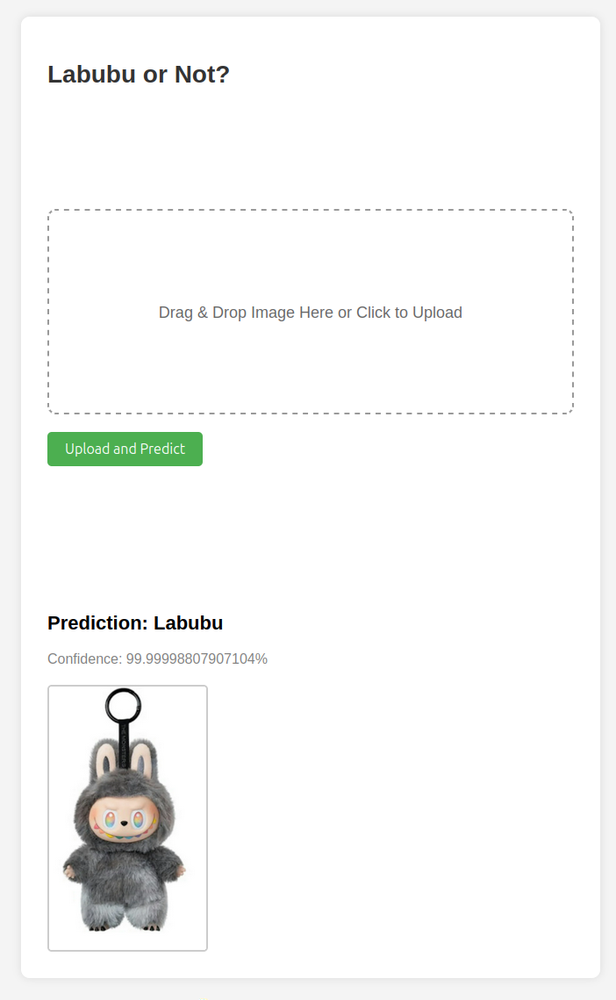
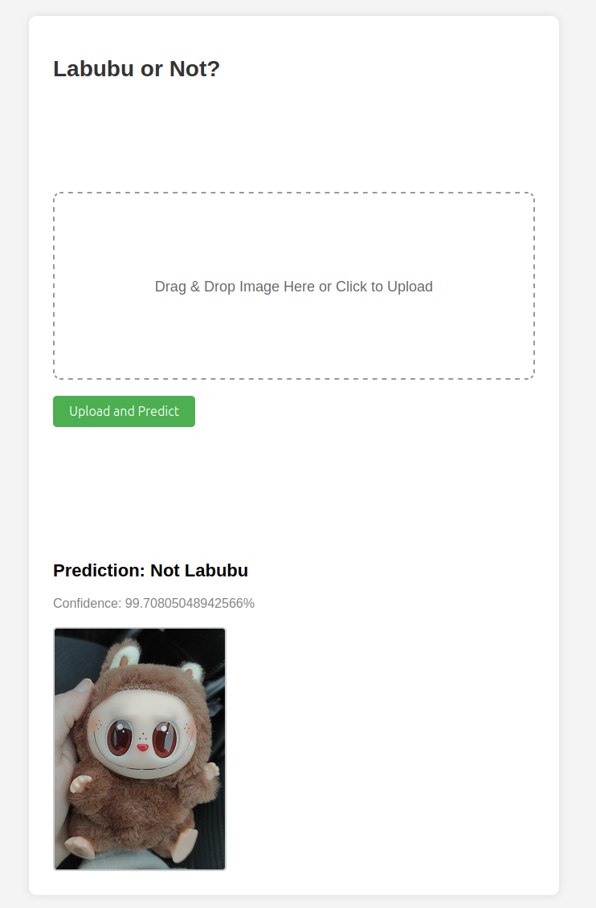

# Labubu Classifier

A web-based image classification application that determines whether an uploaded image contains an authentic **Labubu** character or not. The system uses a fine-tuned ResNet18 model in PyTorch and is deployed using Flask on Render.

**Live Application:** [Labubu Classifier](https://labubu-classifyer.onrender.com/)

---

## Overview

This project applies computer vision to distinguish authentic Labubu figures from visually similar counterfeit variants (“Lafufu”). It demonstrates a complete ML pipeline from data collection to deployment.

---

## Motivation

Counterfeit collectibles are increasingly difficult to distinguish visually. This project explores how lightweight deep learning models can assist in **real vs. fake classification** using image-based features.

---

## Demo

### Web Interface
<p align="center">
  
</p>

### Correct Predictions
<p align="center">
  
  
</p>

### Example Inputs
<p align="center">
  
  
</p>

---

## Features

- Image upload + real-time inference  
- Binary classification (Labubu vs Not Labubu)  
- Confidence scoring  
- Lightweight web deployment  

---

## Model

- Architecture: ResNet18 (modified FC layer)  
- Input: 224×224 RGB images  
- Output: 2-class softmax  

### Dataset

| Class | Total |
|------|------|
| Labubu | 3,000 |
| Not Labubu | 4,500 |

Includes augmentation for robustness across lighting, pose, and background variation.

---

## Engineering Decisions

- **ResNet18**: lightweight, fast inference, sufficient for binary classification  
- **Flask**: simple deployment and minimal overhead  
- **CPU inference**: compatible with low-cost hosting (Render)  
- **RGB normalization fix**: ensures consistent 3-channel input (prevents runtime errors)

---

## Performance

- Real-time inference (~tens of ms on CPU)  
- High accuracy on validation dataset (binary classification task)  
- Robust to common variations (angle, lighting, background)

---

## Tech Stack

- Python, Flask  
- PyTorch, torchvision  
- Pillow  
- Render  

---


## Run Locally

```bash
git clone https://github.com/johnnyjvang/labubu_classifyer.git
cd labubu_classifier
pip install -r requirements.txt
python app.py
```

---

## Future Work

- Expand dataset (edge cases + rare variants)  
- Multi-class classification (specific Labubu types)  
- UI improvements  
- Batch inference  

---

## License

MIT License
